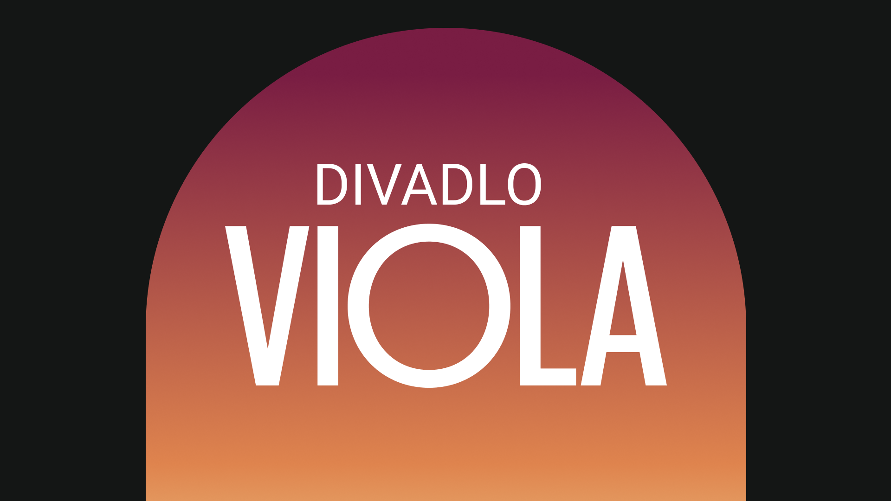

# Divadlo Viola

### Goal of the project
Move this theatre to modern age with new branding

### My team
Our team consited of three graphic designer - Pavel Štutzbart, Jan Jursík and me. Each of us came with cool ideas which make the final product.

### Role
Graphic designer | Ideamaker | Project manager 

### Dates
March 2022 - Present

## Insight

Viola is interesting because 3 main pillars:

1. Small and cozy space with specific architecture
2. Really famous actors for cheap prices
3. Great location in the centre of Prague

Content goes here…

Note: Use Markdown for headings, paragraphs, lists, quotes, images, etc., to add structural meaning to your content.
