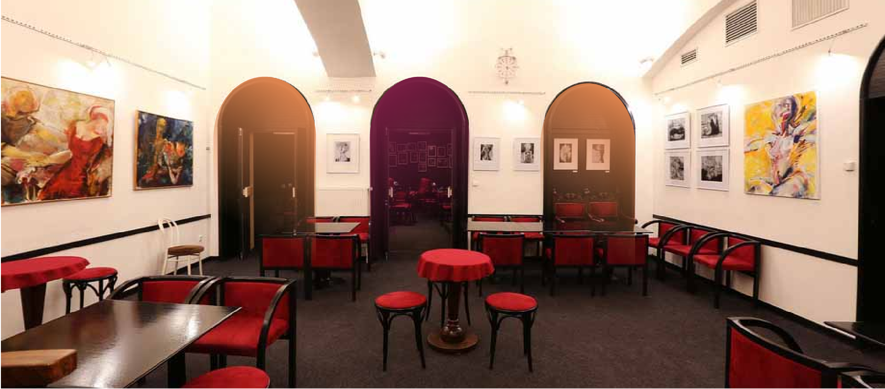

# Divadlo Viola

### Goal of the project
Move this theatre to the modern age with new branding

### My team
Our team consisted of three graphic designers - Pavel Štutzbart, Jan Jursík, and me. Also, we cooperated with another team so the final product is a fusion of two cool ideas - one from us and the second from them.

### Role
Graphic designer | Ideamaker | Project manager 

### Dates
March 2022 - Present

## Insight

Viola is interesting because <b>3 main pillars:</b>

1. Small and cozy space with specific architecture
2. Famous actors for cheap prices
3. Great location in the center of Prague

### First tries
At the beginning of the project, we were a bit stuck with unique ideas. We tried for example word clouds, atypic formats, and blurry images... but these ideas did not work well, but then we came up with <b>the concept of portals</b>

## The concept of portals

<b>Portals</b> - an architectural element you can find all over the place. Portals fit perfectly as our primary visual key.

<b>Photos</b> - Portals and good photos of actors made a perfect combination of the insight pillars.

<b>Colors</b> - We kept the iconic purple color but we added beige color to have more options to operate with

<b>Typeface</b> - Font Roc Grotesk suited best for our purposes - Condensed styles for headlines, regular styles for text.

## How does it look today + Learnings

We won this tender and the implementation of this project is ongoing now.

The biggest learning for us was that even if we can not come up with something good for a long time we have to keep going and we will find it.

Also, we learned that making the project live could be hard even though the client loved it at first glance.

<b>And that is it! </b>

