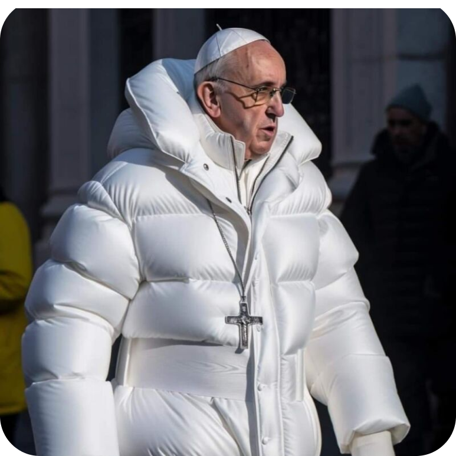
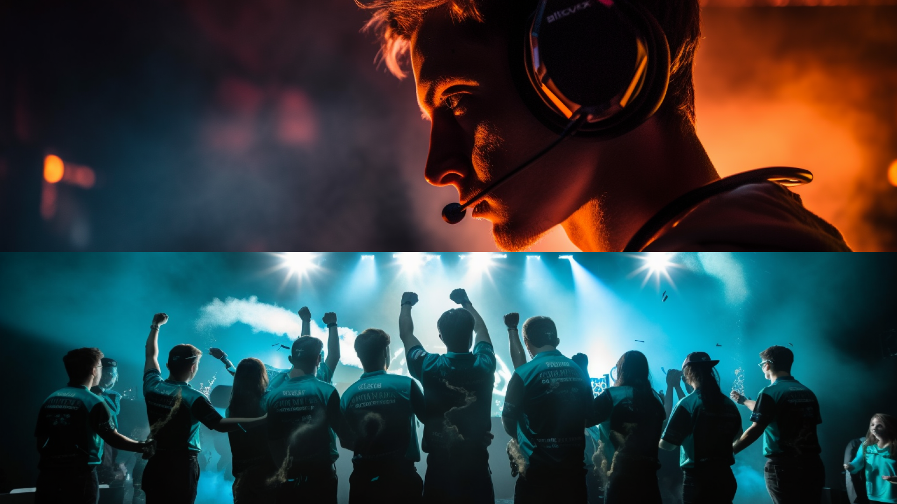
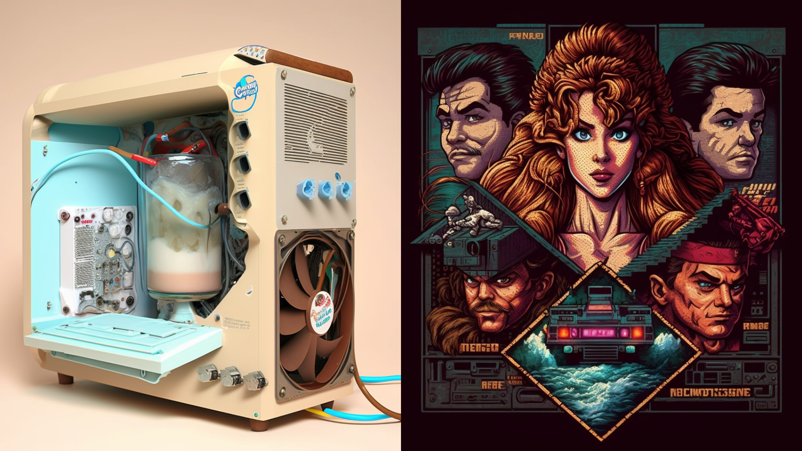
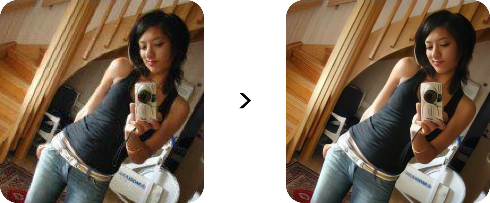
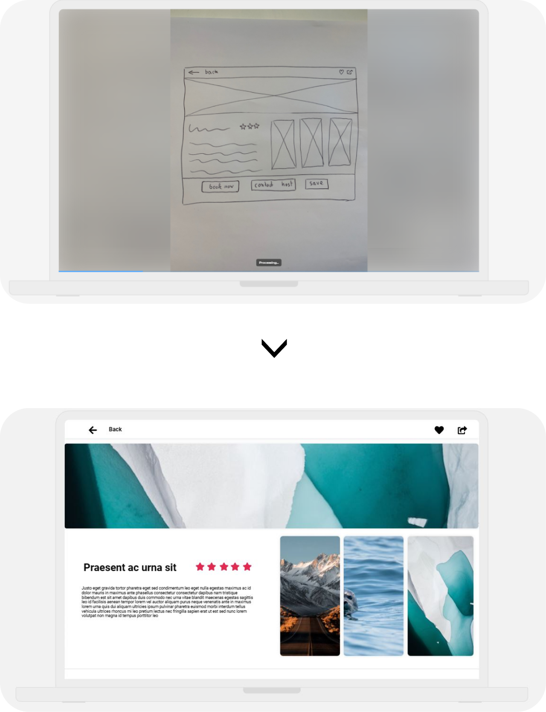
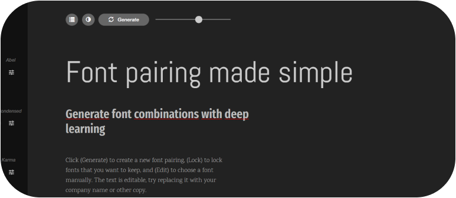
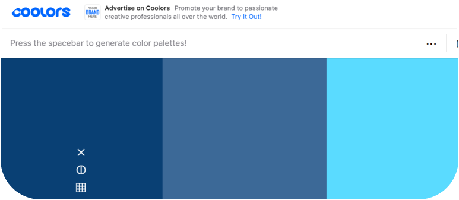
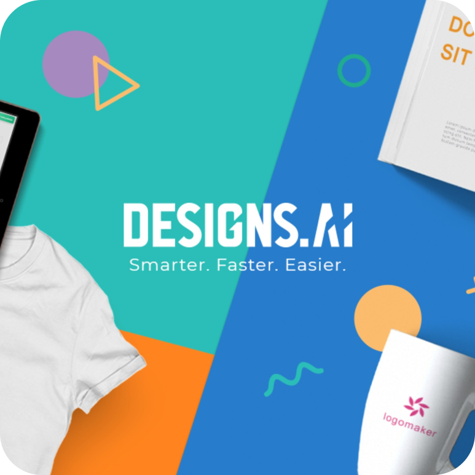

<h1>✨ From sleepless nights to sweet dreams: How AI can save your time ✨</h1>

<b>Kryštof Henzl</b>

<a href="storytelling_henzl.pdf">PDF version</a>

🤖 AI is changing the world super fast and even though it sometimes feel like it is a buzzword it can be super helpful for designers to save time. This storytelling will show some of the examples!

‼️ <b>Disclaimer</b> The field of artificial intelligence is rapidly advancing, with new breakthroughs and developments emerging on a daily basis.
So even this presentation might be already outdated. ‼️

<a href="https://www.figma.com/file/maB216Ijj5hQzpIvTzUs5o/ENGLISH---PREZO?type=design&node-id=46%3A51&t=8Skxl26Ii7Jy1gAk-1">Check out the presentation in Figma here!</a>

<h2>Topics of the presentation</h2>
<ul>
  <li>AI generated images</li>
  <li>Image helpers</li>
  <li>UI design</li>
  <li>Typography & Colors</li>
  <li>Ultimate tool</li>
  <li>Conclusion</li>
</ul>

<h1>AI Generared images</h1>

<h3>These are some cool tools for generating AI images:</h3>
<ul>
  <li>MidJourney</li>
  <li>Dall-e 2</li>
  <li>Stable Diffusion</li>
   <li>CrAIyon</li>
  <li>Adobe Firefly</li>
</ul>

<h3>Examples of my usage of AI images</h3>
<ul>
  <li>Moodboards</li>
  <li>Inspiration</li>
  <li>Actual designs</li>
  <li>Photos</li>
  <li>And many more...</li>
</ul>

<h3>Some of my images</h3>

<h1>Image helpers</h1>

<h3>Cut outs</h3>

So you have your sweet image but you want to cut it out. <b>RemoveBG</b> got you.

<h3>Image Enhancers</h3>

Do you need to enhance resolution of your images? No problem for the AI.

<ul>
  <li>TOPAZ Gigapixel</li>
  <li>Let's Enhance</li>
  <li>VanceAI</li>
  <li>And many more...</li>
</ul>

<h1>UI design</h1>

Sketch of wireframe...into design in 5 seconds by <b>UIzard</b>

<h1>Typography & Coolors</h1>

<h3>Fontjoy</h3>

This tool can help you with picking the right fonts for you.

<h3>Coolors</h3>

This tool can help you with picking the right colors for you.

<h1>Ultimate tool</h1>

With Designs.ai you can create copy & visuals for your social media content, create videos, posters, edit photos and many more!

<h1>Conclusion</h1>

These were just a few examples from my experience... I would recommend you to follow social media channels and websites which provide informations about new AI tools and updates because there is something new every week now.

<h3>Thank you!</h3>

