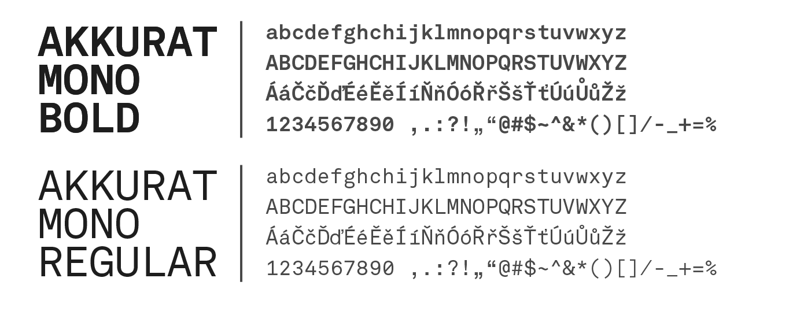

<h1>3E ACADEMIC CHAMPIONSHIP</h1>
<a href="https://www.figma.com/file/fMgCcSWo0Q8yqMxDczCzRu/3E-Akadamick%C3%A9-mistrovstv%C3%AD?type=design&node-id=710%3A654&t=zeVzU0BnVyFSkBeq-1">Full presentation is here!</a>

<a href="3EAM_HENZL_BACHELORTHESIS.pdf> PDF Version </a>

<h1>Table of contents</h1>

  [The purpose of the work](#the-purpose-of-the-work) 
  [New logo](#new-logo) 
  [Colors and Typography](#colors-and-typography) 
  [Components of the visual style](#components-of-the-visual-style) 
  [Motion design](#motion-design) 
  [Social Media and Webiste](#social-media-and-website) 
  [Offline merchandise](#offline-merchandise) 
  [Online merchandise](#online-merchandise) 
  [Marketing directions](#marketing-directions) 

<h1>The purpose of the work</h1>
  <h3>What is esport</h3>

“Esports turns online gaming into
a spectator sport. It mimics the experience of watching a professional sporting event, except instead of watching a physical event, spectators watch video gamers compete against each other. The esports trend has become so widespread in recent years that games can often be viewed at an organized arena event.”

          
  <h3>3E Academic Championship</h3>

3E Academic Championship (abbreviated 3E:AM) is an e-sports competition for students of Czech universities. The competition has been running regularly since 2018 and is thus a traditional competition).

A special event is the semester finals, which usually takes place offline on the campus of some of the universities. This event is also linked to an accompanying programme such as lectures.

The aim of the ESA organisation, which runs the competition, is to link education with esport through lectures and workshops.

 
          

         
However, due to the emergence of new student competitions, and the interest of other big brands, interest in 3E:AM is starting to decline significantly.
  
  

  
  

 

  

There is no united visual style nowadays. The visuals look so random and they even do not look good. The logo is fine by me but it is too complicated. 

  
<h1>New logo</h1>
The logo has three meanings:
<ul>
<li>The logo symbolizes the battle of 2 sides for the trophy... just like in an esports match.</li>
<li>The symbol in the middle represents a trophy for the winner and also an exclamation mark, which is often used in games to indicate danger.</li> 
<li>The symbols on the sides are "just" mirrored reversed, but still one is a "3" and the other an "E"</li>
</ul>

  

        
<h1>Colors and Typography</h1>
<h3>CGA color scheme</h3>

The visual style has two main colors (pink and turquoise), this color scheme loosely refers to old video games from the 80s and 90s that made extensive use of the CGA graphics standard, which was the first standard for color graphics on the PC. These colours are almost complementary, which ensures good contrast. Also I created gradients from these colors.

  

 
 These colours are almost complementary, which ensures good contrast. Also I created gradients from these colors.

  

<h3>Typography</h3>
<h4> Acumin Pro </h4>

The main font is Acumin Pro. It is a neogrotesque sans serif font that is suitable for both headlines and regular text. The 2 main versions used for headings are ExtraCondensed Black and Wide Black. For the Wide version, I have taken the liberty of stretching the font to 150% of its width in some cases. The font is used exclusively in headings with a few exceptions. For regular text it is advisable to use the Medium version.

          
<h4> Akkurat Mono </h4>

For subheadings, minor texts and decorative elements I chose Akkurat Mono. The non-proportional Akkurat, together with the proportional Acumin, creates the necessary contrast. In the visual identity, the Regular and Bold cuts are used (but the latter is the primary variant). On the other hand, from Acumin onwards, the typeface does not have to be used exclusively in versals.

          

<h1>Components of the visual style</h1>

<h3>Grid rule</h3>

Most elements in the visual are set in a grid. Its top layer is visible. The bottom layer (which is 4 times more detailed) is not visible, but the viewer's eye automatically assumes the grid. The individual elements then appear to be in place, where they are supposed to be.

  

<h3>Brush strokes</h3>

To keep the visual style from being too rigid, brushstrokes are built in that don't get tied to the grid, giving the visuals a fresher feel. They are used to highlight important information or to provide colour balance.

  

<h3>Repetitive elements</h3>

Repeating elements are used to fill the empty space. These elements can be a repeating symbol
or a filled text box with the same text.

  

<h1>Motion design</h1>

Motion design is very useful for my subject as it is used during livestreams, on social networks, etc. It is much more interesting than the classic static visuals.

         

<h1>Social Media and Website</h1>
<h3>Instagram</h3>

Most important social media for the 3E:AM.
The content should be divided into these categories:

<ul><li>Information on the competition process</li>

<li>Educational content</li>

<li>Memes</li>

<li>Highlights (Reels)</li>

<li>Photos</li></ul>

  

<h3>Facebook</h3>

Same content as on the Instagram. But also using the feature of Facebook events.

  

<h3>TikTok</h3>

Focusing more on the highlights from the games and lectures. Also more of the meme content.

  

<h3>LinkedIn</h3>

Completely different content. Content should be targeted primarily at potential sponsors and employers. It should show the benefits of esport and how it is interesting for big companies.

  

<h3>Website</h3>

  

<h1>Offline Merchandise</h1>

<h3>Compression sleeve</h3>

Compression sleeves are popular among players as they reduce muscle fatigue and improve blood circulation in the arm, which can be a key factor during a long game.

  

<h3>Mousepad</h3>

Most esport games require a high level of precision and mouse speed. A large pad allows players more room to move, which can improve the accuracy and speed.

  

<h3>Blue light glasses</h3>

Gamers spend a lot of time in front of the computer, exposing themselves to high levels of blue light that can negatively affect their health and performance. Glasses with a blue light filter are designed to block some blue light.

  

<h3>Hoodie</h3>

Everyone wants a cool hoodie... right?

  

<h3>Trophy</h3>

In this case, of course, it is not an item suitable for sale. An original and good-looking trophy can be an interesting part of 3E:AM that will stand out from the common idea of a trophy as a gold cup.

  

  
<h1>Online merchandise</h1>

<h3>Hearthstone Wallpapers</h3>

Simple free wallpapers for fans on their computer or mobile phone can be a very simple but effective promotional material. 
I created a wallpaper design that usesa character from the Hearthstone game, but uses my visual style.

  

  
<h3>CS:GO Weapon Skins</h3>

Skins are one of the most iconic features in CS:GO. Although skins are physically intangible, players pay real money for them in order to have the nicest and rarest looking weapon possible. However, it is also possible to create your own skins and offer them for money or for free. For 3E:AM I have created a design for such a skin for the MAC-10 weapon.

  

<h3>LOL AR Filter</h3>

I created an AR filter that allows League of Legends fans to select their favorite character. Out of a total of 16 characters, the user always votes in each duel by nodding their head. In the end, there will be one last, most popular character.

  

  

  
<h1>Marketing Directions</h1>
  
  <h3>Influencers</h3>
  
Influencers can be used as ambassadors. Ambassadors are usually people with a large social media following who can spread brand awareness by posting content from events, informing about news, etc.

  
  <h3>Competetive education</h3>
  
3E:AM may include additional tournaments, not in computer games, but in areas such as financial literacy, programming, etc. Here, a link with the already ongoing competitions is proposed.

  
  <h3>International</h3>
  
Winning 3E:AM can serve as a qualification for international tournaments. This attribute can make the whole competition much more attractive.

  
  
  <b>THAT IS IT, THANKS!</B>

